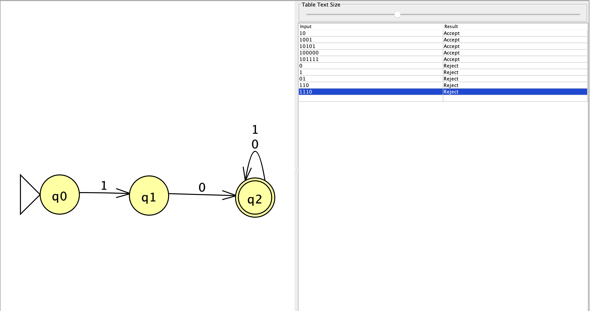
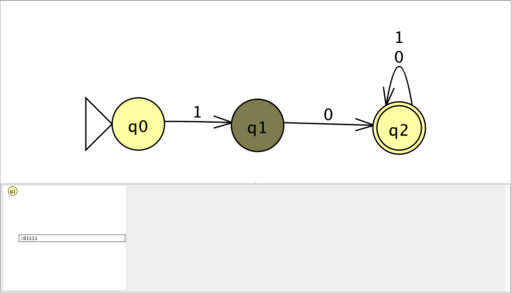
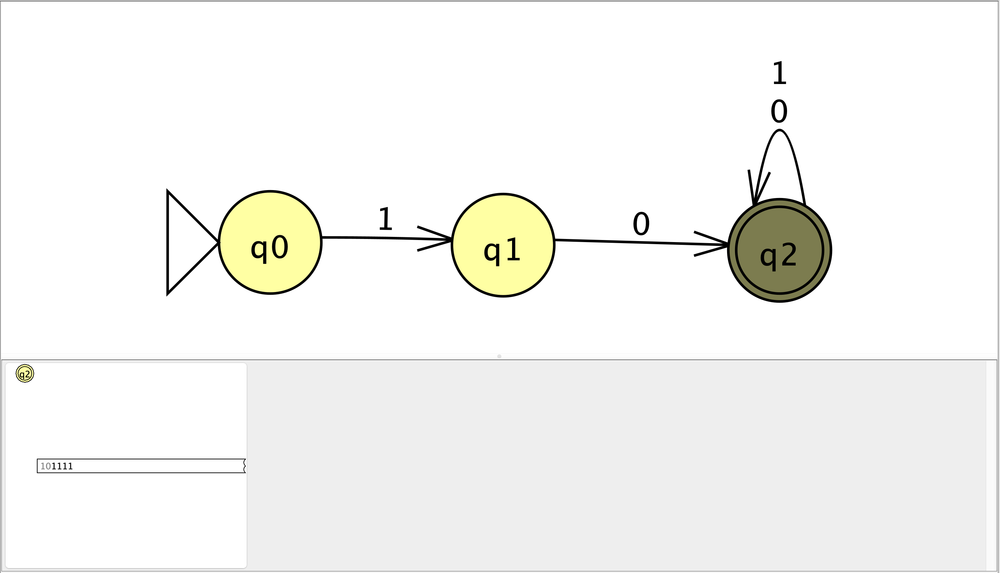
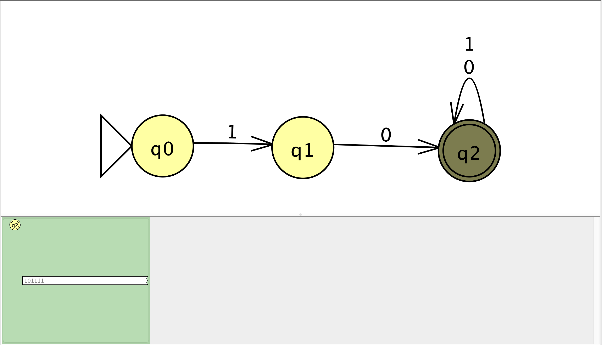

## 1. Picture of the NFA

## 3. Challenging String and Computation

The challenging string I chose was `101111`.
### JFLAP Step-by-Step Screenshots

#### After reading `1`

#### After reading `10`

#### After reading `101`

#### After reading `1011`

#### After reading `10111`

#### After reading `101111`

