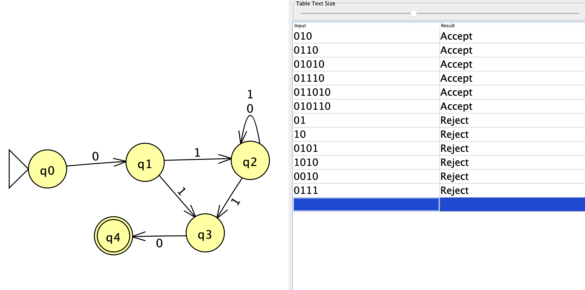
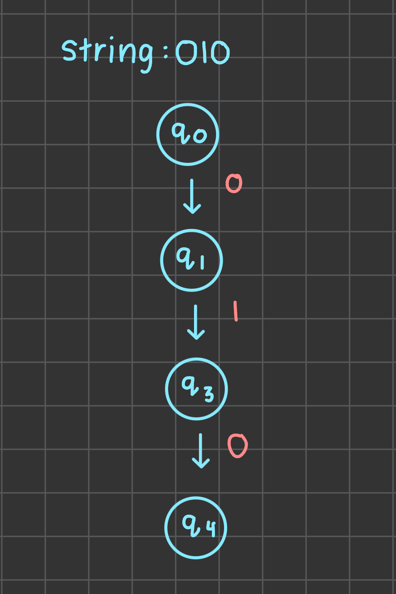
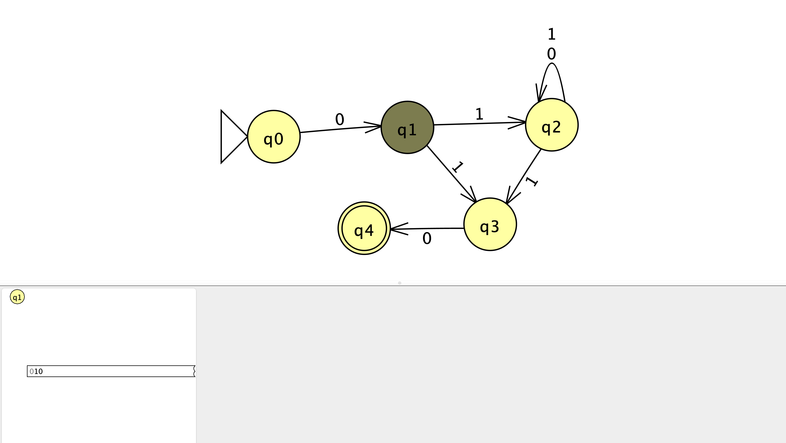
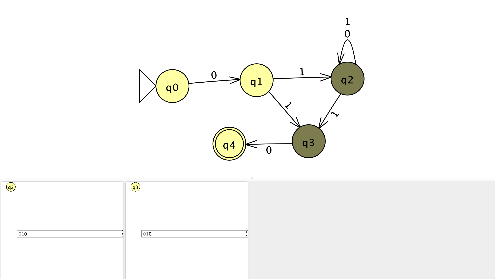
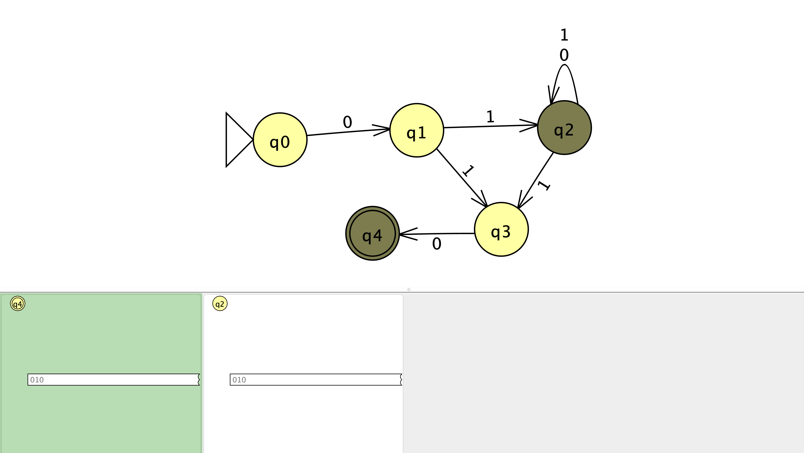

## 1. Picture of the NFA and batch runs

## 2. Hand drawn picture of the NFA and batch runs

## 3. Challenging String and Computation

The challenging string I chose was `010`.
### JFLAP Step-by-Step Screenshots

#### After reading `0`

#### After reading `01`

#### After reading `010`

