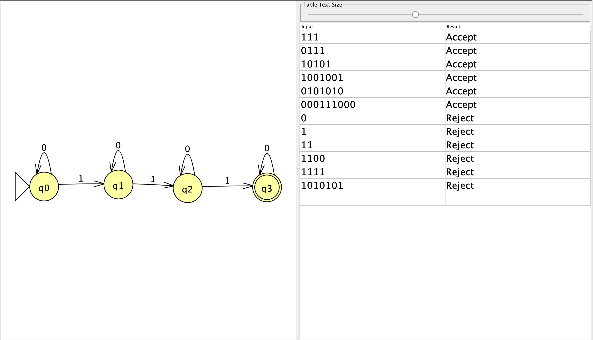
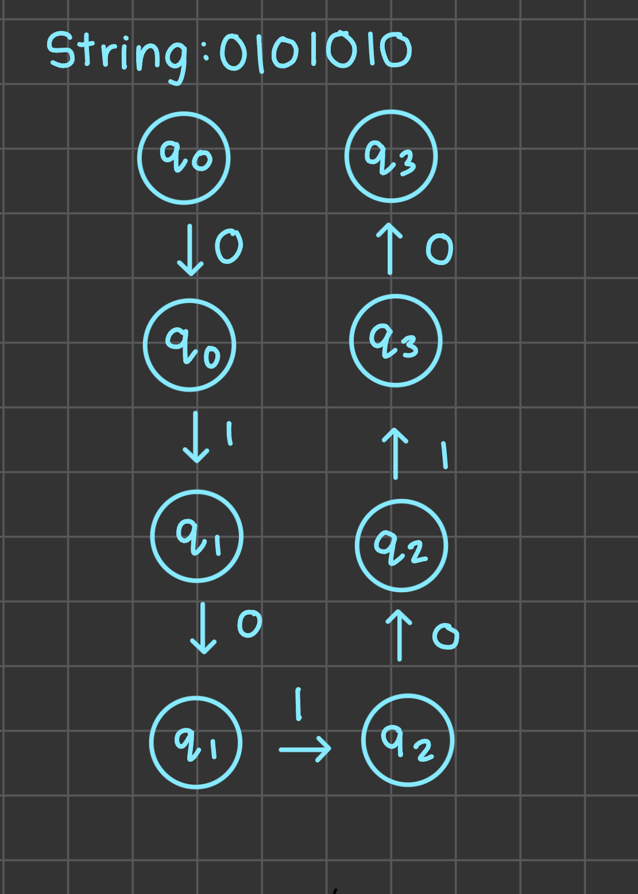
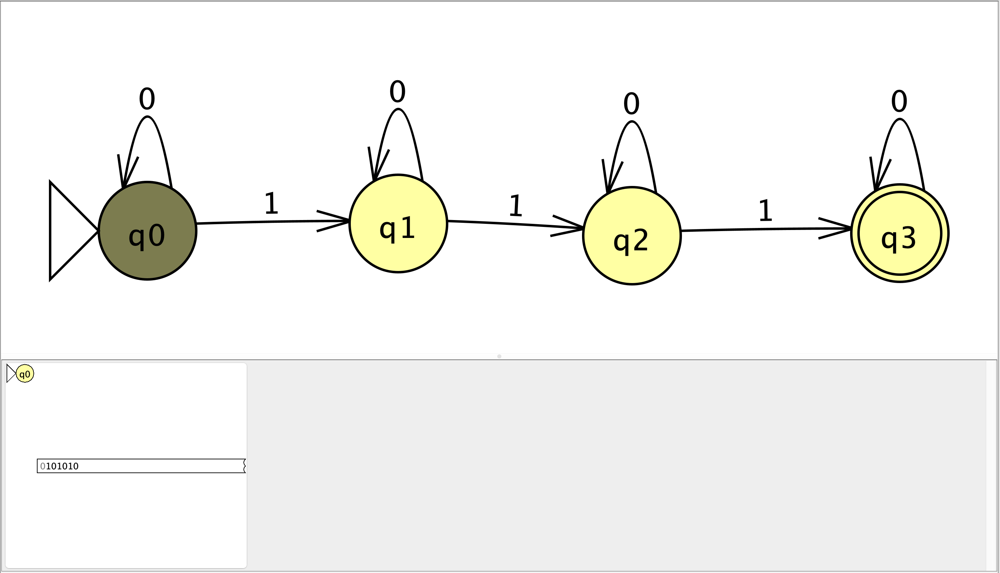
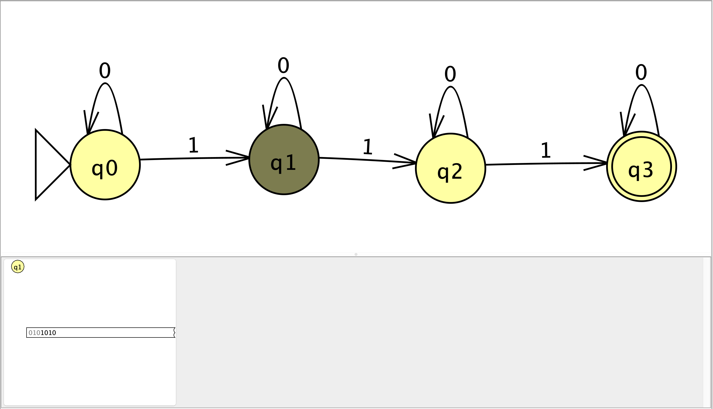
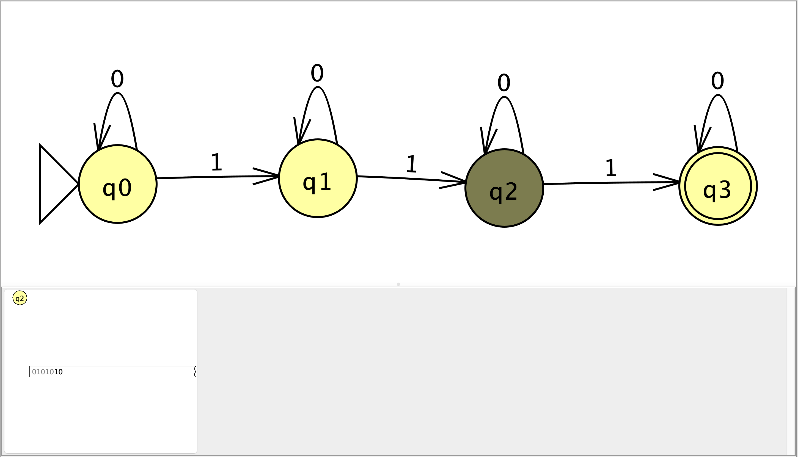
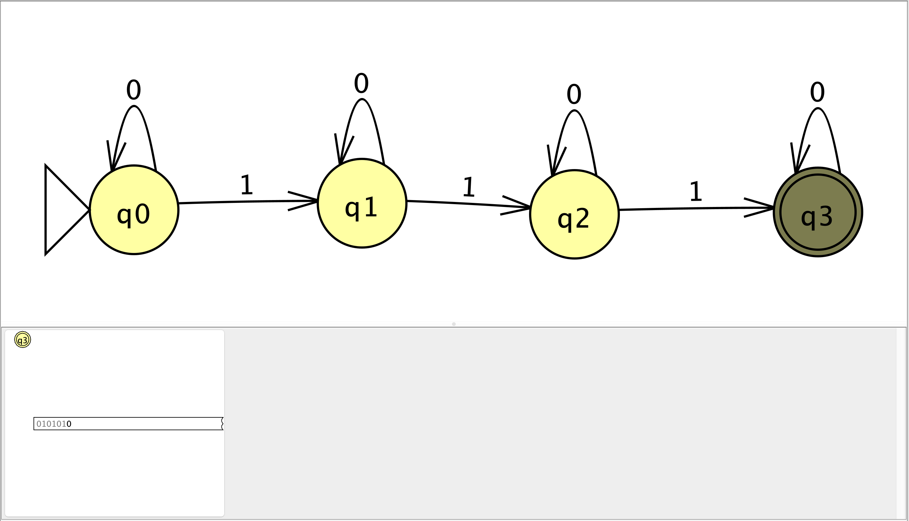
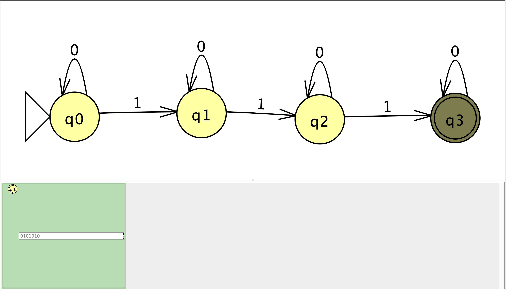

## 1. Picture of the NFA and batch runs: string s|s contains exactly 3 1's

## 2. Hand drawn picture of the NFA and batch runs

## 3. Challenging String and Computation

The challenging string I chose was `0101010`.
### JFLAP Step-by-Step Screenshots

#### After reading `0`

#### After reading `01`

#### After reading `010`

#### After reading `0101`

#### After reading `01010`

#### After reading `010101`

#### After reading `0101010`

